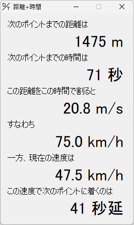

距離÷時間
==========

## これは何？

[TRAIN CREW](https://acty-soft.com/traincrew/) 向けの運転支援ソフトです。

次のポイント (駅などの到達すべきタイミングが決まっている地点のこと。分岐器ではない) までの距離を同ポイントに着くべきタイミングまでの時間で割り、走行するべき速度の目安を表示します。  
また、今の速度で走行し続けた場合に次のポイントに着くタイミングの予測も表示します。

## 使用上の注意

提示する速度やタイミングは単純な計算で求めており、あくまでも目安です。  
信号を含む速度制限などの影響により、表示される速度で走り続けることができない可能性があります。  
また、次のポイントで停車する場合、停車のための減速の影響で予測と実際の結果が大きくズレる可能性があります。

## ライセンス

「距離÷時間」は、MITライセンスです。

TrainCrewInput.dll (TRAIN CREW 入出力ライブラリ) は溝月レイル/Acty様の制作物であり、MITライセンスの対象外です。  
TrainCrewInput.dll の解析や改変は禁止されています。

## ビルド方法

Windows 環境では、以下の方法でビルドを行います。

1. `make` コマンドを使えるようにする  
   例えば [Make for Windows](https://gnuwin32.sourceforge.net/packages/make.htm) をインストールする
2. C# コンパイラ `csc.exe` があるディレクトリにパスを通す  
   例えば `C:\Windows\Microsoft.NET\Framework\v4.0.30319`
3. `make` コマンドを実行する
